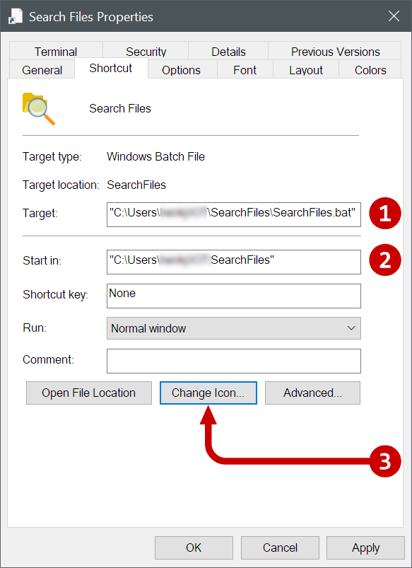
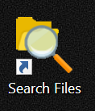

# SearchFiles
This is a Python script with GUI to search for files and copy results to the clipboard.

This script is written on a Windows system, but should work on other operating systems.

Libraries used by the script that must be installed:
* PyQt5
* Pyperclip

These libraries can be installed from the command line by using:

```
python -m pip install pyqt5
python -m pip install pyperclip
```

Or by using a package manager.


# Running the script
The script can be run by calling Python:

```
"{python location}\python" "{script location}\SearchFiles.py"
```

If the script is used on more than one computer, a settings file can be created for each computer. The settings files are stored in the .app directory. For example, there can be an asus.json and an hp.json file for two computers. 

An additional ```--settings``` argument can be used to specify the name of the settings file:

```
"{python location}\python" "{script location}\SearchFiles.py" --settings {settings file}
```

For example:

```
"c:\Users\username\anaconda\python" "c:\Users\username\github\searchfiles\SearchFiles.py" --settings asus.json
```

# Creating a batch file on the desktop

## Step 1. Create a batchfile
On windows, a .bat file can be created with the following content:

```
@echo off
"{directory where python is}\python" "{directory where the script is}SearchFiles.py" --settings {settings file}
```
## Step 2. Create a shortcut to the batchfile

Copy the batchfile and paste it as shortcut on the desktop

## Step 3. Modify the icon

Modify the properties of the shortcut:
1. Ensure the target references the batchfile
2. Ensure "Start in.." address references the directory in which the python script resides
3. Click on the "Change Icon..." button and locate the .\\.icons\\icon_search_folder.ico file



## Step 4. Rename the shortcut

Give the shortcut a useful name, such as "Search Files". 

By now, the icon on the desktop should activate the script.



It is possible to use the script on more than one computer, by creating differently named batchfiles and repeating the steps above on each computer.


